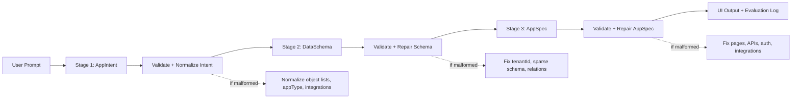
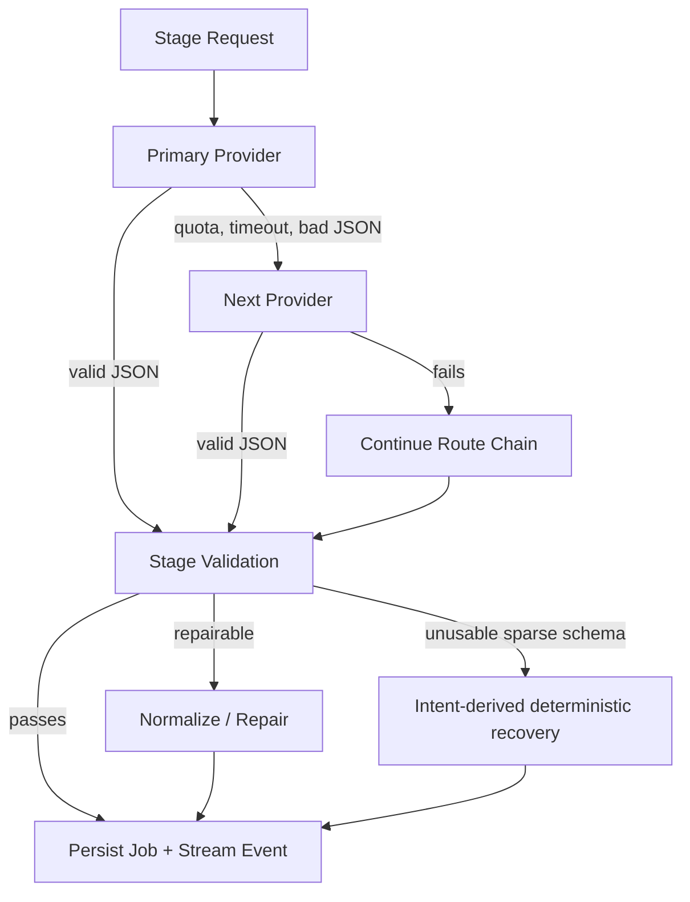
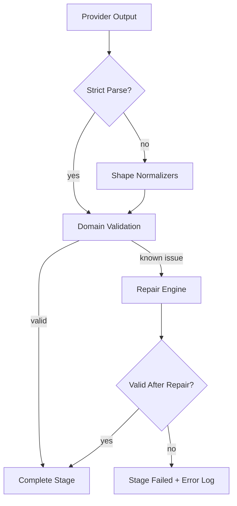
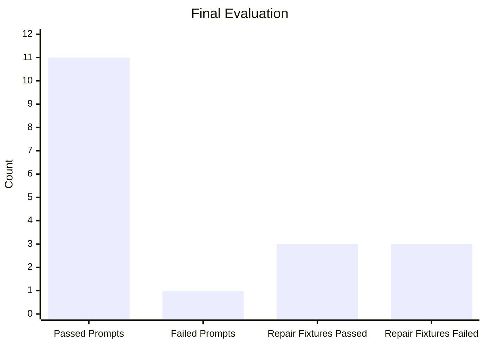

# OneAtlas AppSpec Generation Pipeline

Multi-stage AI pipeline for the OneAtlas 3-day AI Engineer trial. It converts a natural-language app request into a validated machine-readable `AppSpec` through three contracts:

1. `AppIntent`
2. `DataSchema`
3. `AppSpec`

The current deployed app is available at:

```text
https://3-day-trial.vercel.app
```

## Current State

- Fullstack Next.js app with React UI, Tailwind styling, API routes, and SSE stage progress.
- Multi-provider AI gateway with ordered failover across configured providers.
- Strict Zod validation after each stage.
- Generic provider-output normalization for messy JSON shapes, sparse schemas, invalid auth rules, relation issues, page layout variants, and malformed field/entity formats.
- Manual repair endpoint plus evaluation suite covering 12 prompts and malformed repair fixtures.
- Redis/KV-backed job persistence for Vercel when KV env vars are configured, with local in-memory fallback.
- Final deployed evaluation: `11/12` prompts passed, `91.67%` success rate.

## Quick Start

```powershell
npm.cmd install
Copy-Item .env.example .env.local
npm.cmd run dev
```

Open:

```text
http://localhost:3000
```

## Environment Variables

Paste real keys into `.env.local`, not `.env.example`.

```env
OPENAI_API_KEY=
GROQ_API_KEY=
GEMINI_API_KEY=
ANTHROPIC_API_KEY=
GOOGLE_AI_API_KEY=
DEEPSEEK_API_KEY=
OPENROUTER_API_KEY=
MISTRAL_API_KEY=
KV_REST_API_URL=
KV_REST_API_TOKEN=
```

Live adapters currently implemented:

- OpenAI
- Groq
- Google Gemini
- Google AI
- DeepSeek
- OpenRouter
- Mistral

Configurable provider option:

- Anthropic

The gateway supports all eight providers as config entries. Anthropic remains configurable but inactive until `ANTHROPIC_API_KEY` is supplied and the adapter is enabled.

## Scripts

```powershell
npm.cmd run dev
npm.cmd run typecheck
npm.cmd run build
npm.cmd run evaluate
```

Run the deployed evaluation:

```powershell
$env:EVAL_BASE_URL="https://3-day-trial.vercel.app"
npm.cmd run evaluate
```

The evaluation writes:

```text
evaluation-results.json
```

## Architecture



## Provider Failover



Stage routes:

| Stage | Ordered Route |
| --- | --- |
| Intent | Groq -> OpenAI -> Gemini -> Google AI -> Mistral -> DeepSeek -> OpenRouter |
| Schema | OpenAI -> Gemini -> Google AI -> DeepSeek -> Mistral -> OpenRouter -> Groq |
| AppSpec | Gemini -> OpenAI -> Google AI -> DeepSeek -> Mistral -> OpenRouter -> Groq |

## API Routes

| Route | Purpose |
| --- | --- |
| `POST /api/generate` | Create a generation job |
| `POST /api/generate/:jobId/run` | Run the full pipeline |
| `GET /api/generate/:jobId` | Read job state/results |
| `GET /api/generate/:jobId/stream` | SSE progress events |
| `POST /api/generate/:jobId/repair` | Manual repair endpoint |
| `GET /api/integrations` | Integration registry |

## Pipeline Contracts

### AppIntent

Extracts:

- `appName`
- `appType`
- `features`
- `entities`
- `integrations_requested`
- `assumptions`

Messy prompts are enriched generically. For example, chat implies `Conversation` and `Message`; shopping implies `Product`, `Order`, `OrderItem`, and `Review`; wallet/banking implies `Wallet`, `Transaction`, and `PaymentMethod`; games imply gameplay and leaderboard entities.

### DataSchema

Generates:

- entities
- fields
- relations
- required `tenantId`
- bidirectional relation consistency

Current hardening includes object-map schema normalization, sparse schema recovery from prompt-derived intent, field type normalization, and automatic inverse relation completion.

### AppSpec

Generates:

- pages
- API endpoints
- auth rules
- integration hooks
- workflow stubs

Current hardening includes page layout normalization, API/page consistency repair, auth rule matrix normalization, integration/action filtering, and schema coverage completion.

## Repair And Normalization



Repair/normalization covers:

- object-style intent features/entities
- invalid or unsupported `appType`
- sparse/empty schema outputs
- missing `tenantId`
- unknown relation targets
- missing inverse relations
- invalid field shape/type variants
- invalid page layouts
- page/API gaps
- malformed auth rules
- invalid integration/workflow references

Manual repair endpoint:

```http
POST /api/generate/:jobId/repair
```

Example body:

```json
{
  "stage": "schema",
  "errorHint": "missing_inverse_relation"
}
```

## Integration Registry

Implemented integration metadata/actions:

- Slack
- WhatsApp via Twilio
- Gmail / Google Workspace
- Stripe
- Jira

Stubbed with clear metadata/interface:

- Google Sheets
- Salesforce
- HubSpot
- Generic Webhook
- Notion
- Airtable
- Twilio SMS
- GitHub
- Zapier

Live OAuth/API calls are intentionally out of scope. The registry includes action names, trigger types, input schemas, and output schemas so a downstream developer can implement the actual third-party calls.

## Evaluation Results

Latest deployed evaluation:

| Metric | Result |
| --- | ---: |
| Required prompts | 12 |
| Successful prompts | 11 |
| Success rate | 91.67% |
| Average latency | 98,988 ms |
| Estimated token cost | $0.472730 |
| Weakest stage | AppSpec |
| Most common failure type | none |
| Malformed repair fixtures | 3/6 |



The single failed prompt was the inventory prompt. It reached schema successfully and failed at AppSpec because the provider returned invalid page `name` values. Full results are in:

```text
evaluation-results.json
```

## Deployment Notes

Deploy the repository as a Next.js project on Vercel. Frontend and backend API routes are deployed together.

Required Vercel environment variables:

- AI provider keys used for live routing.
- `KV_REST_API_URL`
- `KV_REST_API_TOKEN`

The KV values come from Vercel KV / Upstash Redis. They are not stored in code.

## Scope Cuts

- Live OAuth/API calls for third-party integrations are not implemented.
- Integration actions are metadata descriptors suitable for downstream implementation.
- Anthropic is present as a configurable provider option but inactive without key/adapter enablement.
- Generated output is an AppSpec/design specification, not a generated runnable application.
- Deterministic generation is retained as a prompt-derived recovery path and local baseline, not as a silent replacement for live AI when provider output is valid.

## Reviewer Notes

This is intentionally not a single LLM call. Each stage has typed contracts, validation, repair, progress events, persistent job state, provider routing, latency logging, and cost logging. The evaluation suite includes the required 12 prompts and malformed-output repair checks, and the UI exposes the same stage state and repair diagnostics visible through the API.
